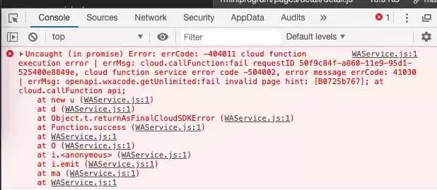

# **笔中记 | 云开发博客小程序**

感谢玄冰 开源分享：  https://github.com/CavinCao/mini-blog 
<iframe frameborder="no" border="0" marginwidth="0" marginheight="0" width=430 height=86 src="//music.163.com/outchain/player?type=2&id=114389&auto=0&height=66"></iframe>

## **学习原因**

- 首先多年的积累，都分散放在电脑，收藏网页等各种角落，不利于自己的回顾及查找，且在一些项目中有了一些灵感或者思考，不能及时整理记录，经常看到有博客精彩分享却没地方收藏，内心十分焦虑。

- 当然我也想到过网页博客，但依旧没有想要的随时随地，于是在GitHub疯狂的寻找原型，对比多款后，选择了云开发博客小程序为蓝本。有一些后续思考将继续以这个为基础进行开发。当然我也会开源，希望能有更多人拥有自己的小博客，创建自己的小天地。再次感谢玄冰程序猿开源。

- 再有考虑就是今后的趋势，移动互联网时代，5G的来临，云开发小程序将迎来爆发增长，小而美，精而全的小应用会有普及，虽然喜欢崇尚技术共享，知识共享的美好愿望，但不得不说这类小应用，都会将一类类的知识划分规整，且走向付费，这是知识产权的保护。人们意识到这是自己的产物，而非“百度就可”寻它。

- 最后也是自己想有一个写写日记的地方，于是起名：**笔中记**
- 纸上得来终觉浅，绝知此事要躬行
- 四象限时间管理法则：
①重要且紧急的事；②重要但不紧急的事；③不重要但紧急的事；④不重要且不紧急的事；

## **小程序介绍**

### 笔中记是一款基于云开发的博客小程序，它的原型就是玄冰的开源mini-blog，该小程序完全不依赖任何后端服务，无需自己的网站、服务器、域名等资源，只需要自行注册小程序账号即可。

### **部署过程**

- 关于本地环境
1.确保小程序IDE是最新的版本。
2.本地已安装nodejs环境（小程序云开发有相关依赖）
3.确保已开通小程序云开发环境，并了解一些基本概念。
- 从GitHub同步小程序源代码：git clone git@github.com:CavinCao/mini-blog.git

- 优先安装云函数本地依赖「每个云函数都需要」
通过命令安装相应的依赖:
```javascript
npm install wx-server-sdk@latest
```
安装完成后，右击相应的云函数，选择创建并部署:所有文件
将代码中所有函数同步上传到云端

- 关于云环境配置

运行小程序前，需要对云环境进行配置，在设置中找到自己的云环境ID
云函数端，为每个云函数进行环境变量的配置，配置的key为Env「注意大小写」，对应value就是你的云环境ID

- 然后是小程序端，小程序端在utils下的config.js中替换自己的云环境id


- 关于云数据库
在数据库新增集合：
```javascript
//缓存小程序or公众号的accessToken
access_token
//小程序文章集合
mini_posts
//小程序评论内容集合
mini_comments
//小程序用户操作文章关联（收藏、点赞）
mini_posts_related
//小程序博客相关配置集合
mini_config
//小程序博客相关操作日志
mini_logs
//小程序博客用户FormID（用于模板消息推送）
mini_formids
-------------------------------------------------------------
//注意：开源中介绍是以上，实际新增的还有三个
//小程序用于记录会员相关汇总数据
mini_member
//小程序签到明细（代码中用于）
mini_sign_detail
//小程序积分明细
mini_point_detail
```


- 在创建完之后，一定修改下集合的权限，不然小程序端是没有权限读取集合中的数据的


- 最重要的就是公众号同步了
    目前最新版与原教程[mini-blog]基于云开发的博客小程序使用教程说明的有点出入

    同步文章的云函数已经从adminService变更为syncService,所以相应的AppId和AppSecret要配置在syncService这个云函数下面

    如果手动执行同步文章云函数报错，皆是由于配置问题导致，请仔细核对AppId和AppSecret是否配置正确「注意大小写，再次强调」

    另外检查公众号对应的白名单是否配置和确认是否存在多处获取access_token的地方「access_token会抢占，其他地方获取过，那小程序端获取的access_token就失效了，影响文章同步」。


- 后台配置比较简单
在adminService云函数下配置对应的环境变量，key名为author,value为相应的openId,可以配置多个，逗号分隔即可。

openId的获取，可以直接看控制台日志，已经打印出来了，在app.js第30行


- 关于海报组件
如果发现文章详情页报错包含wxa-plugin-canvas的错误时，那是说明你本地没有安装海报组件。

相关教程可以参考基于云开发的小程序海报功能的实现,已经写的很详细了。

额外说明下，如果npm安装组件过程中报错，可以尝试将小程序中的package.json和lock.json删除后再进行安装
如果海报组件都已经按照上述步骤完成，但发现会报如下错误
- 程序本身没有问题，是正常的，报错是因为小程序没有发布过线上环境，找不到相应的page地址。

- 原因是在生成海报组件时，会生成当前文章页的小程序码，小程序码中包含的跳转页面的校验是根据你线上环境页面来的「如果页面不存在就会报该错误」。
所以，等小程序上线后可以再尝试点击试下

- 除以上部署内容外，还有一下几点需要注意：
1、小程序中需要用到订阅消息，需要去小程序后台选择模版，留言和提醒两个,需要学习的自行到代码中进行替换。
2、小程序中还有好几个页面告警，需要添加wx:key="key"到提示位置，可以消除告警。
3、海报组件需要自行安装，同步文章需要在云函数通过添加公众号id及Secret进行云端测试同步
4、还有个小bug就是删除文章后收藏以及点赞的地方，文章是不能在点击的，签到后再次进入可以重复签到问题。


## 最后附上玄冰教程地址 相关使用和文章介绍
- [[mini-blog][v2.0.0]博客小程序的一些优化汇总](https://mp.weixin.qq.com/s/V0IwsCx0b0PGIVz6EGaGnQ)

- [[mini-blog]小程序订阅消息踩坑记](https://mp.weixin.qq.com/s/MWSJ4pWBQW1vhEpqj2HEAA)

- [[mini-blog]第一次部署过程中的问题点总结(最近很多人在问)](https://mp.weixin.qq.com/s/GLNSHdWIowwdb5_GHPJkmg)

- [[mini-blog]小程序最近两个迭代版本总结，来看看更新了哪些内容吧](https://mp.weixin.qq.com/s/gmoHSnvw0E6Wld3PewDJNA)

- [[mini-blog][v1.6.0]体现后台管理功能的价值时刻到了——丰富文章的筛选](https://mp.weixin.qq.com/s/TDeBq9oDFxgEIB4vATM3nA)

- [公众号文章同步至云数据库实现](https://www.bug2048.com/wechat20190421/)

- [[mini-blog]基于云开发的博客小程序诞生](https://www.bug2048.com/wechat20190429/)

- [[mini-blog]基于云开发的博客小程序使用教程](https://www.bug2048.com/wechat20190505/)

- [小程序富文本解析的「伪需求」，从wxParse到towxml的坑](https://www.bug2048.com/wechat20190507/)

- [基于云开发的小程序评论、点赞、收藏功能实现总结](https://www.bug2048.com/wechat20190511/)

- [基于云开发的小程序海报功能的实现](https://www.bug2048.com/wechat20190512/)

- [[mini-blog]小程序后台管理功能的实现](https://mp.weixin.qq.com/s/0Wy0RMfsbsl1mpvxN8bPrg)

### 目前实现功能

- 公众号文章同步
- 文章列表、文章详情展示
- 分享、点赞、收藏功能实现
- 评论相关展示和功能实现
- 生成海报功能的实现
- 评论消息通知功能的实现
- 专题、标签相关功能的实现
- 后台管理功能实现（文章管理、评论管理等)

## 总结及展望
总共花了两天时间，总算部署成功，再次由衷感谢开源小哥-玄冰，后续也将根据这个原型，开发维护自己的一些小想法，主要是类似印象笔记的，同时可以有一个小社区，未来想构成一个可扩展的知识社区类型，形成各类知识社区。

